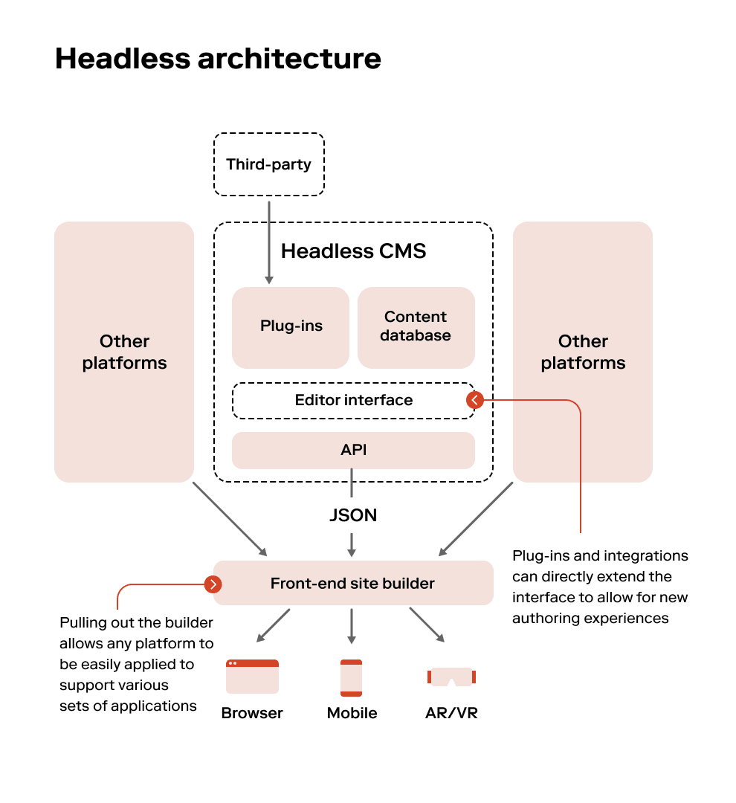

# **Investigación: Características del desarrollo web moderno**

Nombre: Josué Torres Narvaez
Carné: 2018084162
Curso: IC-8057 – Introducción al Desarrollo de Páginas Web
Fecha: 10/08/2025

## **Frameworks de desarrollo web**

---

### ¿Qué es un framework y qué problema resuelve?

Un framework es una colección organizada de recursos, estructuras y normas que establece una base prediseñada para crear aplicaciones de software.

La función principal de un framework es facilitar y acelerar la creación de software. En vez de programar todas las funcionalidades desde el inicio, los desarrolladores aprovechan componentes ya establecidos, verificados y mejorados previamente.

[Fuente: ¿Qué es un framework?](https://imaginaformacion.com/tutoriales/que-es-un-framework)

### Arquitectura general y enfoque

Next.js es un framework de desarrollo web basado en React que se destaca por su flexibilidad y rendimiento. Su arquitectura combina varias técnicas modernas para optimizar la experiencia del usuario y el desarrollo. A continuación, te detallo los aspectos clave de su arquitectura y enfoque:

#### Renderización Híbrida

Next.js permite combinar diferentes estrategias de renderización en una misma aplicación:

- Renderización del lado del servidor (SSR): Genera páginas dinámicas en el servidor para cada solicitud, ideal para contenido que cambia frecuentemente.
- Generación estática (SSG): Crea páginas estáticas en el momento de la compilación, lo que mejora el rendimiento y es perfecto para contenido que no cambia con frecuencia.
- Incremental Static Regeneration (ISR): Permite actualizar páginas estáticas de forma incremental sin necesidad de recompilar toda la aplicación.

[Fuente: Next.js ¿qué es?](https://10code.es/nextjs-que-es/)

### Ejemplo práctico documentado

    my-next-app/
    ├── pages/
    │   ├── index.js         # Página principal
    │   ├── about.js         # Página estática
    │   └── api/
    │       └── hello.js     # Ruta API
    ├── components/
    │   └── Header.js        # Componente reutilizable
    ├── public/              # Archivos estáticos (imágenes, etc.)
    ├── styles/
    │   └── globals.css      # Estilos globales
    ├── next.config.js       # Configuración de Next.js
    └── package.json         # Dependencias y scripts

Fragmento de Código: SSR en ```index.js```

    // pages/index.js
    import Header from '../components/Header';

    export default function Home({ message }) {
      return (
        <div>
          <Header />
          <h1>Bienvenido a Next.js SSR</h1>
          <p>{message}</p>
        </div>
      );
    }

    // Esta función se ejecuta en el servidor en cada solicitud
    export async function getServerSideProps() {
      // Simulación de una llamada a API o base de datos
      const message = 'Este contenido fue generado en el servidor';

      return {
        props: { message }, // Se pasa como prop al componente
      };
    }

### Comparación breve entre al menos dos frameworks

- Next.js: Ofrece una mezcla de SSR y SSG, con flexibilidad para cambiar entre diferentes estrategias de renderizado. Es ideal para sitios web estáticos con contenido dinámico y datos.
- Remix: Se centra en la carga de datos en el lado del servidor y la mejora de la experiencia del usuario. Es adecuado para aplicaciones que requieren carga de datos en el lado del servidor y un enfoque en la velocidad.

[Fuente: Análisis de Next.js vs Remix](https://ichi.pro/es/next-js-vs-remix-analisis-de-aspectos-clave-y-diferencias-147835973248661)

## **Control de versiones y trabajo colaborativo**

---

### ¿Qué es el control de versiones y por qué es esencial?

El control de versiones es un sistema que registra los cambios realizados en archivos a lo largo del tiempo, permitiendo recuperar versiones anteriores, comparar modificaciones, identificar autores de cambios y restaurar archivos perdidos.

[Fuente: Git Book - Acerca del Control de Versiones](https://git-scm.com/book/es/v2/Inicio---Sobre-el-Control-de-Versiones-Acerca-del-Control-de-Versiones#:~:text=%C2%BFQu%C3%A9%20es%20un%20control%20de,a%20un%20costo%20muy%20bajo.)

### Conceptos clave: repositorio, commit, branch, merge, pull request

#### Repositorio

- Es el lugar donde se almacena todo el historial de versiones de un proyecto.

- Puede ser local (en tu computadora) o remoto (como en GitHub).

- Contiene archivos, carpetas y metadatos que permiten rastrear cambios.

#### Commit

- Es una “instantánea” de los cambios realizados en el repositorio.

- Incluye un mensaje descriptivo que explica qué se modificó.

- Cada commit tiene un identificador único (hash) y registra quién hizo el cambio y cuándo.

#### Branch

- Es una línea de desarrollo independiente dentro del repositorio.

- Permite trabajar en nuevas funcionalidades o correcciones sin afectar la rama principal (por ejemplo, ```main``` o ```master```).

- Se pueden crear múltiples ramas para diferentes tareas.

#### Merge

- Es el proceso de combinar los cambios de una rama con otra.

- Generalmente se usa para integrar una rama de desarrollo con la rama principal.

- Puede requerir resolución de conflictos si los cambios se superponen.

#### Pull Request

- Es una petición para que los cambios de una rama sean revisados y fusionados en otra.

- Se usa comúnmente en plataformas como GitHub para facilitar la colaboración.

- Permite comentarios, revisiones y aprobación antes de hacer el merge.

[Fuente: Conceptos principales de Git y GitHub](https://welearndata.com/git/git-github-conceptos-principales/)

## Flujos de trabajo comunes (Git Flow, trunk-based, feature branches)

### Git Flow

- Estructura: Usa ramas dedicadas para desarrollo (develop), producción (main o master), funcionalidades (feature), correcciones (hotfix) y lanzamientos (release).

- Ideal para: Proyectos con ciclos de lanzamiento definidos.

- Ventajas:

  - Organización clara.

  - Separación entre desarrollo y producción.

- Desventajas:

  - Puede ser complejo para equipos pequeños o despliegues frecuentes.

### Trunk-Based Development

- Estructura: Todo se desarrolla directamente en la rama principal (main), con ramas de corta duración para cambios pequeños.

- Ideal para: Integración continua y despliegue frecuente.

- Ventajas:

  - Simplicidad.

  - Menos conflictos de merge.

  - Compatible con feature flags.

- Desventajas:

  - Requiere disciplina para no romper la rama principal.

### Feature Branches

- Estructura: Cada nueva funcionalidad se desarrolla en una rama independiente (feature/nombre), que luego se fusiona con main o develop.

- Ideal para: Equipos que quieren aislar cambios y facilitar revisiones.

- Ventajas:

  - Aislamiento de cambios.

  - Facilita pull requests y revisión de código.

- Desventajas:

  - Puede generar conflictos si las ramas se mantienen por mucho tiempo.

[Fuente: Trunk-Based Development vs Git Flow](https://openwebinars.net/blog/trunk-based-development-vs-git-flow-cual-elegir/)
[Fuente: Feature Branch Workflow - Atlassian](https://www.atlassian.com/git/tutorials/comparing-workflows/feature-branch-workflow)

### Ejemplo de cómo usar Git en un proyecto (inicialización, commits, ramas)

#### Crear el proyecto y el repositorio

    mkdir mi-proyecto
    cd mi-proyecto
    git init

Esto convierte la carpeta en un repositorio Git. Se crea una carpeta oculta .git.

#### Crear archivos y hacer el primer commit

    echo "Hola, mundo!" > index.html
    echo "Este es mi primer proyecto con GIT" > README.md
    git add index.html README.md
    git commit -m "Commit inicial: se agregan archivos básicos"

#### Hacer cambios y nuevos commits

    echo "<h1>Bienvenido a mi proyecto</h1>" >> index.html
    git add index.html
    git commit -m "Agrega título a index.html"

    touch estilo.css
    git add estilo.css
    git commit -m "Agrega archivo de estilos"

#### Crear y trabajar con ramas

    git branch nueva-funcionalidad
    git checkout nueva-funcionalidad

Luego:

    git add .
    git commit -m "Implementa nueva funcionalidad"

#### Fusionar ramas

    git checkout main
    git merge nueva-funcionalidad

Esto integra los cambios de la rama nueva-funcionalidad en la rama principal.

#### Ver historial de commits

    git log

[Fuente: Curso COMPLETO de GIT y GITHUB desde CERO para PRINCIPIANTES](https://www.youtube.com/watch?v=3GymExBkKjE)

### Herramientas recomendadas (GitHub, GitLab, Bitbucket)

#### GitHub

Ventajas principales:

- Comunidad enorme y activa
- Integración con GitHub Actions para CI/CD
- Interfaz intuitiva
- Gran soporte para proyectos open source

Ideal para:

- Proyectos públicos
- Colaboración masiva

#### GitLab

Ventajas principales:

- CI/CD integrado desde el inicio
- Permite instalar en servidores propios
- Más control sobre privacidad

Ideal para:

- Empresas que necesitan control interno

#### Bitbucket

Ventajas principales:

- Integración nativa con Jira y Trello
- Repositorios privados ilimitados en planes gratuitos
- Buen enfoque en equipos pequeños

Ideal para:

- Equipos que usan Atlassian y repositorios privados

[Fuente: Comparación detallada de Bitbucket vs GitHub vs GitLab](https://ichi.pro/es/comparacion-detallada-de-bitbucket-vs-github-vs-gitlab-176119360235044)

## **Autenticación y seguridad moderna**

---

### Conceptos: autenticación, autorización, tokens, JWT, OAuth

#### Autenticación

- Verifica que el usuario es quien dice ser. Ejemplo: iniciar sesión con usuario y contraseña.

#### Autorización

- Determina qué acciones puede realizar ese usuario una vez autenticado. Ejemplo: acceder a datos privados.

#### Tokens

- Son credenciales digitales que representan la identidad de un usuario.

- Se usan para acceder a recursos protegidos sin tener que enviar usuario y contraseña en cada solicitud.

- Tipos comunes:

  - Access Token: Permite acceder a una API.

  - Refresh Token: Permite obtener un nuevo access token cuando el anterior expira.

#### JWT (JSON Web Token)

- Es un formato de token que contiene información codificada y firmada digitalmente.
- Compuesto por tres partes:
  - Header: Tipo de token y algoritmo de firma.
  - Payload: Información del usuario (claims).
  - Signature: Verifica que el token no ha sido alterado.
- Se usa comúnmente en autenticación sin estado (stateless), ideal para APIs REST.

#### OAuth 2.0

- Es un protocolo de autorización que permite a aplicaciones acceder a recursos sin compartir credenciales del usuario.
- Funciona mediante un servidor de autorización que emite tokens.
- Se complementa con OpenID Connect (OIDC) para agregar autenticación (verificar identidad).

#### Ejemplo práctico

- Un usuario inicia sesión en una app.
- La app redirige al servidor de autorización (OAuth).
- El servidor autentica al usuario y devuelve un access token (posiblemente en formato JWT).
- La app usa ese token para acceder a recursos protegidos.

[Fuente: IAM, OAuth, OIDC, SAML, SSO, JWT](https://blog.logto.io/es/iam-oauth-oidc-saml-sso-jwt)
[Fuente: JWT vs OAuth](https://geekflare.com/es/jwt-vs-oauth/)

### Diagrama de flujo explicativo del proceso de autenticación con JWT

    [Usuario] 
        │
        ▼
    [Envía credenciales (usuario/contraseña)]
        │
        ▼
    [Servidor de autenticación (IdP)]
        │
        ├─ Verifica credenciales
        │
        └─ Si son válidas:
            │
            ▼
      [Genera JWT con datos del usuario]
            │
            ▼
      [Envía JWT al cliente]
            │
            ▼
    [Cliente almacena el JWT (ej. en localStorage)]
            │
            ▼
    [Cliente hace solicitudes a la API con el JWT en el encabezado Authorization]
            │
            ▼
    [Servidor de recursos (API)]
        │
        ├─ Verifica la firma del JWT
        ├─ Extrae datos del usuario del payload
        └─ Autoriza o rechaza la solicitud

[Fuente: IAM, OAuth, OIDC, SAML, SSO, JWT](https://blog.logto.io/es/iam-oauth-oidc-saml-sso-jwt)
[Fuente: JWT vs OAuth](https://geekflare.com/es/jwt-vs-oauth/)

### Buenas prácticas en seguridad web

Actualización de software y dependencias:

- Mantén actualizado el sistema operativo, frameworks, librerías y plugins.
- Usa herramientas como npm audit, OWASP Dependency-Check o Snyk para detectar vulnerabilidades.

#### Cifrado de comunicaciones

- Implementa HTTPS con certificados SSL/TLS válidos.
- Fuerza el uso de HTTPS con redirecciones y encabezados ```Strict-Transport-Security```.

#### Protección perimetral

- Configura firewalls de red y Web Application Firewalls (WAF) como ModSecurity.
- Usa reglas específicas para bloquear patrones de ataque (ej. SQLi, XSS).

#### Validación y sanitización de entradas

- Valida datos en el cliente y servidor.
- Escapa caracteres peligrosos para prevenir XSS (<, >, ', ").
- Usa ORM para evitar inyecciones SQL.

#### Autenticación y autorización robusta

- Implementa autenticación multifactor (MFA).
- Usa protocolos seguros como OAuth 2.0 y OpenID Connect.
- Aplica control de acceso basado en roles (RBAC).

#### Pruebas de seguridad

- Realiza escaneos con herramientas como OWASP ZAP, Burp Suite, Nikto.
- Haz pruebas de penetración periódicas.
- Usa ```Content Security Policy (CSP) y Subresource Integrity (SRI)```.

#### Gestión de sesiones y tokens

- Usa cookies seguras (```Secure, HttpOnly, SameSite=Strict```).
- Expira tokens JWT y sesiones tras inactividad.
- Evita almacenar tokens en ```localStorage``` si hay riesgo de XSS.

#### Concienciación y formación

- Capacita al equipo en seguridad web, ingeniería social y gestión de incidentes.
- Establece políticas de seguridad claras y revisables.

[Fuente: Desarrollo de páginas web seguras - Buenas prácticas y estrategias](https://www.cisinformatica.cat/es/desarrollo-de-paginas-web-seguras-buenas-practicas-y-estrategias/)
[Video: Buenas prácticas en seguridad web](https://www.bing.com/videos/riverview/relatedvideo?q=Buenas+pr%c3%a1cticas+en+seguridad+web.&&mid=A2B19BA286FB9A0C8CEDA2B19BA286FB9A0C8CED&FORM=VAMGZC)

### Aplicaciones reales en plataformas modernas

#### E-commerce (Shopify, WooCommerce, Magento)

Prácticas aplicadas:

- Cifrado HTTPS obligatorio.
- Validación de formularios para prevenir XSS.
- Autenticación multifactor para administradores.
- Protección contra CSRF en procesos de pago.

#### Aplicaciones en la nube (AWS, Azure, Google Cloud)

Prácticas aplicadas:

- Gestión de identidades con IAM.
- Tokens JWT para autenticación sin estado.
- Escaneo automático de vulnerabilidades en contenedores.
- Auditoría de logs y alertas en tiempo real.

#### Plataformas de desarrollo low-code (OutSystems, Mendix, Jitterbit)

Prácticas aplicadas:

- Seguridad desde el diseño (Secure by Design).
- Controles de acceso basados en roles (RBAC).
- Integración con OAuth 2.0 y OpenID Connect.
- Validación automática de entradas de usuario.

#### Aplicaciones con IA y APIs modernas (F5, LovTechnology)

Prácticas aplicadas:

- Protección de endpoints con rate limiting y WAF.
- Uso de Content Security Policy (CSP).
- Firma digital de tokens y verificación de integridad.
- Segmentación de redes y microservicios seguros.

[Aplicaciones reales en plataformas modernas de Buenas prácticas en seguridad web (Bing Search)](https://www.bing.com/search?q=Aplicaciones%20reales%20en%20plataformas%20modernas%20de%20Buenas%20pr%C3%A1cticas%20en%20seguridad%20web&qs=n&form=QBRE&sp=-1&ghc=1&lq=0&pq=aplicaciones%20reales%20en%20plataformas%20modernas%20de%20buenas%20pr%C3%A1cticas%20en%20seguridad%20web&sc=10-80&sk=&cvid=13FE73D489AA41F7B7EB6243060BF22F)

## **Gestores de contenido desacoplados (Headless CMS)**

---

### Definición de Headless CMS vs CMS tradicional

#### ¿Qué es un CMS?

Un CMS (Content Management System) es una plataforma que permite crear, editar y administrar contenido digital sin necesidad de escribir código directamente. Ejemplos clásicos incluyen WordPress, Joomla y Drupal.

#### CMS Tradicional

Características:

- Arquitectura monolítica: el backend (gestión de contenido) y el frontend (presentación) están acoplados.
- El contenido se almacena y se muestra en la misma plataforma.
- Usa plantillas integradas para renderizar el contenido.

Ventajas:

- Fácil de instalar y usar.
- Vista previa en tiempo real.
- Plugins y temas listos para usar.

Limitaciones:

- Menor flexibilidad para personalizar el frontend.
- Dificultad para distribuir contenido en múltiples canales (web, móvil, IoT).
- Escalabilidad limitada en entornos complejos.

#### Headless CMS

Características:

- Separación total entre backend y frontend.
- El CMS solo gestiona el contenido y lo expone vía API (REST o GraphQL).
- El frontend puede construirse con cualquier tecnología (React, Vue, Flutter, etc.).

Ventajas:

- Alta flexibilidad y personalización.
- Ideal para distribución multicanal (web, apps móviles, dispositivos).
- Mejor rendimiento y escalabilidad.

Limitaciones:

- Requiere desarrollo personalizado del frontend.
- Mayor complejidad técnica.
- No incluye vista previa integrada.

[Video: Definición de Headless CMS vs CMS tradicional](https://www.bing.com/videos/riverview/relatedvideo?q=Definici%c3%b3n+de+Headless+CMS+vs+CMS+tradicional&&mid=0D0BD8FFC24264A91B460D0BD8FFC24264A91B46&FORM=VAMGZC)
[Fuente: Comparación de Headless CMS vs CMS tradicional (webhosting.de)](https://webhosting.de/es/headless-cms-vs-tradicional-cms-comparacion-ventajas-y-desventajas/)

### Arquitectura basada en APIs

#### Componentes clave

##### API Gateway

Actúa como puerta de entrada unificada para los clientes, manejando:

- Enrutamiento a microservicios correspondientes.
- Autenticación y control de acceso, asegurando políticas de seguridad centralizadas.
- Agregación de respuestas desde múltiples servicios.
- Transformación de protocolos (por ejemplo, de REST a gRPC).
- Monitoreo, caché, balanceo de carga y más.

##### Comunicación entre servicios

Se utilizan protocolos como:

- RESTful HTTP / JSON: fácil de usar y ampliamente adoptado.
- gRPC: alto rendimiento y comunicación eficiente mediante HTTP/2.
- Opción de mensajería asíncrona para mayor resiliencia y desacoplamiento.


[Fuente: Microservicios y APIs - MuleSoft](https://www.mulesoft.com/es/api/microservices/microservices-and-apis?)
[Fuente: Arquitectura de microservicios - IT Patagonia](https://itpatagonia.com/es_es/arquitectura-de-microservicios-claves)
[Fuente: Building Microservices Using an API Gateway (F5)](https://www.f5.com/es_es/company/blog/nginx/building-microservices-using-an-api-gateway)


### Ventajas, limitaciones y casos de uso comunes

Ventajas:

- Escalabilidad independiente: Cada servicio se puede escalar de forma autónoma según demanda, optimizando el uso de recursos y reduciendo costos operativos. Por ejemplo, durante eventos de alto tráfico como el Black Friday, solo el servicio más demandado se escala.
- Despliegues rápidos y ágiles: Permite actualizar o desplegar componentes específicos sin afectar a toda la aplicación, acelerando ciclos de desarrollo y facilitando DevOps y CI/CD.
- Diversidad tecnológica: Cada servicio puede usar el stack tecnológico más adecuado (lenguaje, framework, base de datos), promoviendo innovación y adaptabilidad.
- Resiliencia y aislamiento de fallos: Un fallo en un servicio no compromete toda la aplicación. Esta compartimentación mejora la tolerancia y la disponibilidad general.
- Mayor productividad: Equipos pequeños pueden desarrollar de manera independiente, favoreciendo la rapidez y autonomía.

Desventajas:

- Complejidad operativa elevada: Gestionar múltiples servicios exige orquestación avanzada, logging distribuido, tracing, despliegue y monitoreo robusto.
- Comunicación distribuida y latencia: La interacción entre servicios añade overhead de red, lo que puede impactar el rendimiento.
- Gestión de datos distribuida: Mantener consistencia transaccional y sincronización de datos entre servicios es más complicado. Se requieren patrones como sagas o event sourcing.
- Mayor consumo de recursos: Cada microservicio usa su propio entorno de ejecución, lo que puede incrementar la infraestructura necesaria.
- Complejidad organizacional: Se necesita cultura DevOps, equipos multidisciplinarios y autonomía clara para que cada equipo gestione ciclo completo de sus servicios.
- Riesgos de fragmentación y fallos en cascada: Sin estándares claros, la proliferación de APIs puede causar incoherencias, duplicaciones y puntos únicos de falla.
- Seguridad y monitoreo más exigentes: Cada nueva API expuesta amplía la superficie de ataque y exige mecanismos robustos de autenticación, autorización y rastreo.

Casos de uso comunes:

- Plataformas grandes o distribuidas: Empresas como Amazon o Netflix, con muchos equipos y funcionalidades aisladas, adoptan microservicios para permitir despliegues rápidos y autonomía.
- Sistemas que requieren alta disponibilidad y resiliencia: Donde un fallo parcial no debería dañar todo el sistema.
- Contextos de picos de carga variables: Como e-commerce o pagos, donde solo ciertos módulos necesitan escalar rápidamente.
- Migración incremental desde monolitos: Al avanzar gradualmente hacia microservicios con técnicas como strangler fig pattern.
- Sistemas multidominio altamente especializados, ejemplo: Mercado Libre, donde cada funcionalidad (chat, búsqueda, recomendaciones) es manejada por un microservicio distinto, permitiendo a cada equipo trabajar y desplegar de forma independiente.

[Fuente: Arquitectura de Aplicaciones: Monolítica vs. Basada en Microservicios](intuitivo.ar/arquitectura-de-aplicaciones-monolitica-vs-basada-en-microservicios/)
[Fuente: Microservicios y API clave para la escalabilidad empresarial (Impacto TIC)](https://impactotic.co/micrositios-tic/sectorti/hardware-software/microservicios-y-api-clave-para-la-escalabilidad-empresarial/?utm_source=chatgpt.com)

### Ejemplo de cómo se conecta el frontend a un CMS headless



#### Usando React con REST (por ejemplo, con Axios)

    import React, { useEffect, useState } from 'react';
    import axios from 'axios';

    const MyComponent = () => {
      const [content, setContent] = useState(null);

      useEffect(() => {
        axios.get('https://mi-cms-headless.com/api/content')
          .then(response => setContent(response.data));
      }, []);

      return (
        <div>
          {content ? content.body : 'Cargando...'}
        </div>
      );
    };

    export default MyComponent;

Este patrón sencillo permite hacer peticiones HTTP directamente al CMS y renderizar el contenido en el componente.

[Fuente: Headless CMS - The Future of Content Management](https://ergoseo.com/blog/headless-cms-the-future-of-content-management)

## **Pasarelas de pago en aplicaciones web**

---

### ¿Qué es una pasarela de pago? ¿Qué rol cumple en una aplicación moderna?

Una pasarela de pago (o payment gateway) es una tecnología esencial en el comercio digital que sirve como puente seguro entre el cliente, el comercio y las entidades financieras involucradas en una transacción en línea. Autoriza, encripta y transmite los datos de pago para realizar cobros de manera confiable y rápida.

#### Rol en una aplicación moderna

- Seguridad: Protege la información sensible mediante cifrado y normativas como PCI DSS, evitando fraudes y accesos no autorizados.

- Soporte de múltiples métodos de pago: Desde tarjetas tradicionales hasta billeteras digitales (como Apple Pay, PayPal) e incluso métodos alternativos (APM) en distintos países.

- Facilidad de integración: La mayoría ofrecen APIs, plugins o SDKs que permiten una integración rápida en sitios web, móviles o aplicaciones sin necesidades complejas de infraestructura.

- Conversión optimizada y mejor experiencia de usuario: Al simplificar el proceso de pago y ofrecer opciones variadas, se reduce la fricción y se incrementan las ventas.

- Analytics y funcionalidades avanzadas: Muchas pasarelas informan sobre el comportamiento de compra, permiten suscripciones recurrentes, pagos programados, y facilitan integraciones con contabilidad o CRM.

[Fuente: ¿Qué es una pasarela de pagos y cómo funciona?](https://www.botondepagos.com.co/blog/que-es-una-pasarela-de-pagos-y-como-funciona/237/)

### Requisitos comunes: cuenta de comercio, seguridad, integración técnica

#### Cuenta de comercio (Merchant Account)

- Cuenta de comercio especializada: Es una cuenta bancaria donde primero se depositan los fondos de las transacciones antes de transferirse al banco empresarial. Algunas pasarelas incluyen esta cuenta, mientras que otras requieren abrir una aparte con un proveedor específico.
- Proceso de aprobación: La apertura puede implicar verificación de identidad, evaluaciones de riesgo e incluso análisis crediticio del negocio.

#### Seguridad y cumplimiento normativo

- SSL/TLS: Es imprescindible tener un certificado SSL para cifrar la comunicación entre el navegador del cliente y tu servidor.
- Cumplimiento PCI DSS: Obligatorio para todos los negocios que procesan o transmiten datos de tarjetas. Incluye prácticas como protección de datos, acceso controlado, monitoreo de redes y evaluaciones periódicas.
- Tokenización: Sustituye datos sensibles (como números de tarjeta) por tokens no sensibles, reduciendo riesgos y simplificando el cumplimiento de PCI DSS
- Detección de fraudes: Herramientas como AVS, CVV, análisis de comportamiento, geolocalización y scoring de riesgo ayudan a prevenir transacciones fraudulentas.
- Autenticación robusta:
  - Multi-factor / Strong Customer Authentication (SCA): En Europa, requisitos como PSD2 exigen autenticación reforzada para pagos electrónicos.
- Auditorías y monitoreo continuo: Realizar evaluaciones de seguridad regularmente, monitorear anomalías en transacciones y mantener sistemas actualizados.

#### Integración técnica

- Credenciales API: Debes obtener claves o tokens de API del proveedor de la pasarela y almacenarlos de forma segura (por ejemplo, en variables de entorno).
- Documentación y SDKs: La mayoría de pasarelas como Stripe, PayPal, etc., ofrecen documentación detallada y librerías para distintos entornos y plataformas.
- Manejo de errores y experiencia del usuario: Es fundamental gestionar correctamente errores en transacciones, dar retroalimentación clara al usuario y garantizar un flujo transparente .
- Entorno de pruebas (sandbox): Probar mediante sandbox permite garantizar que la integración funcione correctamente antes de ir a producción.
- Escalabilidad y rendimiento: La integración debe soportar altos volúmenes de transacciones simultáneas sin afectar la experiencia ni la seguridad.
- Métodos de pago múltiples: Idealmente, soportar tarjetas, billeteras digitales (Apple Pay, Google Pay, etc.) y otras opciones relevantes según el mercado.

[Fuente: Ventajas y limitaciones de integrar pagos en línea.](https://www.eliftech.com/insights/best-practices-to-integrate-payment-gateway-into-your-business/)
[Fuente: Payment Gateway Integration Checklist for Developers (apnnews.com)](https://www.apnnews.com/payment-gateway-integration-checklist-for-developers/)

#### Ventajas y limitaciones de integrar pagos en línea

Ventajas:

- Mayor seguridad: Se aprovechan tecnologías robustas como cifrado, tokenización y detección de fraudes, reduciendo significativamente el riesgo de ataques y brechas de datos.
- Mejor experiencia de usuario y conversión: Un proceso de pago fluido, opciones como pagos en un clic, compatibilidad móvil y múltiples métodos de pago promueven la satisfacción del usuario y reducen el abandono de carrito.
- Acceso global y multinacional: Se pueden aceptar pagos de clientes en distintos países y monedas, lo que ayuda a expandir el mercado y alcanzar más clientes internacionales.
- Implementación rápida y escalabilidad: Las soluciones preexistentes permiten una integración ágil, mientras que la infraestructura escalable se adapta a aumentos de volumen sin necesidad de construir desde cero.
- Cumplimiento normativo simplificado: Los proveedores externos suelen encargarse del cumplimiento de normativas como PCI DSS, reduciendo la carga operativa y los riesgos legales para el negocio.

Limitaciones:

- Costos por transacción y cargos adicionales: Las pasarelas de pago suelen cobrar comisiones por transacción, suscripciones mensuales, y algunos cargos ocultos, lo que afecta especialmente a negocios con márgenes ajustados.
- Dependencia técnica y disponibilidad: Las interrupciones del servicio, errores de red o alta latencia pueden comprometer las transacciones y frustrar clientes.
- Desafíos de integración: Integrar una pasarela con sistemas personalizados o legados puede ser complicado, consumiendo tiempo y recursos técnicos especializados.
- Menor control y personalización del proceso de pago: Muchas soluciones limitan la personalización del flujo de pago, lo que puede afectar la experiencia de marca o la coherencia visual del checkout.
- Mayor exposición a disputas y contracargos: Operar con pagos en línea implica un riesgo inherente de contracargos y fraudes, lo que puede generar costos operativos y carga administrativa adicional.
- Cumplimiento y seguridad siguen siendo críticos: Aunque se delega gran parte de la responsabilidad, la plataforma sigue necesitando medidas como SSL, monitoreo constante y auditorías de seguridad.

#### Comparación entre al menos dos pasarelas

| Característica       | **Stripe**                             | **Tilopay**                                         |
| -------------------- | -------------------------------------- | --------------------------------------------------- |
| Alcance geográfico   | Global, +135 monedas                   | Enfoque regional (Centroamérica & LatAm)            |
| Métodos de pago      | Internacionales (tarjetas, wallets)    | Locales (Yappy, Sinpe, financiamiento, QR, enlaces) |
| Seguridad            | Muy robusta (Radar, PCI, etc.)         | Cumple con estándares (3DS2.0, PCI, tokenización)   |
| Integración técnica  | Compleja, pero muy poderosa API        | Fácil, con conectores y plugins                     |
| Costos y liquidación | Tarifas estables; liquidación estándar | Tarifas variables (posible elevado costo)           |
| Soporte usuario      | Mayor infraestructura global           | Limitado según experiencia de algunos usuarios      |

[Fuente: Stripe Gateway Overview](https://www.paidmembershipspro.com/gateway/stripe/gateway-overview/)
[Fuente: Types of payment gateways: A quick guide for businesses](https://stripe.com/en-cz/resources/more/types-of-payment-gateways)
[Fuente: https://tilopay.com/metodos-de-pago](https://tilopay.com/metodos-de-pago)
[Fuente: https://tilopay.com/sobre-tilopay](https://tilopay.com/sobre-tilopay)

## **Automatización del despliegue y hosting moderno**

---

### ¿Qué es CI/CD y por qué se usa en desarrollo web?

- CI (Continuous Integration, o Integración Continua): implica que los desarrolladores integran frecuentemente sus cambios en un repositorio compartido (como Git), lo que desencadena automáticamente compilaciones y tests automatizados para detectar errores lo antes posible.
- CD puede referirse a dos conceptos relacionados:
  - Entrega Continua (Continuous Delivery): el software está siempre en un estado listo para desplegar, con el traslado a producción generalmente bajo aprobación humana.
  - Despliegue Continuo (Continuous Deployment): los cambios que pasan todas las pruebas se despliegan automáticamente en producción sin intervención manual.

#### ¿Por qué se usa en desarrollo web?

- Entrega más rápida y eficiente: Las actualizaciones llegan al mercado con mayor velocidad, lo que permite una respuesta ágil a feedback y tendencias del usuario.
- Mejor calidad de código y menos errores: El testing automatizado en cada etapa evita que errores lleguen a producción.
- Retroalimentación instantánea: Si algo falla, los desarrolladores lo saben al instante y pueden corregirlo rápidamente.
- Automatización que reduce errores humanos: Evita procesos manuales y considera estructuras robustas para lanzamiento y rollback, generando mayor estabilidad.
- Colaboración más fluida: Facilita el trabajo conjunto entre desarrollo, QA y operaciones, generando sinergia y responsabilidad compartida.
- Escalabilidad y flexibilidad: CI/CD se adapta a arquitecturas como microservicios o despliegue en la nube y permite iteraciones veloces.
- Reducción de riesgos y costos: Se minimizan fallos críticos, tiempos de inactividad y esfuerzo manual, mejorando la inversión en desarrollo.

[Fuente: Continuous Integration and Continuous Delivery/Deployment (arxiv.org)](https://arxiv.org/abs/1703.07019)
[Fuente: Benefits of CI/CD (Zeet)](https://zeet.co/blog/benefits-of-cicd)
[Fuente: Benefits of CI/CD in Software Development](https://kodekaizen.com/benefits-of-ci-cd-in-software-development)

### Hosting estático vs dinámico

#### Definiciones

- Hosting estático: entrega archivos preconstruidos (HTML, CSS, JS) sin procesamiento en el servidor. El contenido es idéntico para todos los usuarios.
- Hosting dinámico: genera páginas en tiempo real mediante código del lado del servidor (PHP, Node.js, Python, etc.) y bases de datos. El contenido puede variar según la interacción del usuario.

#### Comparativa

| Característica                 | Hospedaje Estático                            | Hospedaje Dinámico                                 |
| ------------------------------ | --------------------------------------------- | -------------------------------------------------- |
| **Velocidad**                  | Muy alta                                      | Variable (según optimización)                      |
| **Costo**                      | Bajo                                          | Alto (infraestructura + mantenimiento)             |
| **Seguridad**                  | Muy alta (sin backend)                        | Más riesgo (requiere vigilancia activa)            |
| **Interactividad y funciones** | Limitada (requiere soluciones externas)       | Alta (formularios, usuarios, CMS, e-commerce)      |
| **Facilidad de actualización** | Manual                                        | Desde panel de gestión (ej. CMS)                   |
| **Escalabilidad**              | Excelente para tráfico, limitado en contenido | Funcionalmente escalable, requiere infraestructura |

### Flujo de despliegue automatizado

- Commit en el repositorio: El proceso comienza cuando un desarrollador realiza un commit en el sistema de control de versiones (por ejemplo, Git). Este commit puede ser una actualización en una rama específica o una solicitud de incorporación de cambios (pull request).
- Compilación del código: El sistema de integración continua (CI) detecta el cambio y compila el código para asegurarse de que no haya errores de sintaxis o dependencias faltantes.
- Pruebas automatizadas: Se ejecutan pruebas automatizadas, que pueden incluir:
  - Pruebas unitarias: Verifican el funcionamiento de componentes individuales del código.
  - Pruebas de integración: Aseguran que diferentes partes del sistema funcionen juntas correctamente.
  - Análisis estático de código: Detecta posibles vulnerabilidades o malas prácticas en el código.

- Generación de artefactos: Si las pruebas son exitosas, se generan artefactos listos para ser desplegados, como contenedores Docker, archivos comprimidos o imágenes de máquinas virtuales.
- Despliegue en entornos de prueba: Los artefactos se despliegan automáticamente en entornos de prueba o staging, donde se realizan pruebas adicionales para validar el comportamiento en un entorno similar al de producción.
- Despliegue en producción: Si las pruebas en staging son satisfactorias, el sistema realiza el despliegue en producción. Dependiendo de la configuración, este paso puede requerir aprobación manual o ser completamente automatizado.
- Monitoreo y retroalimentación: Después del despliegue, se monitorea el rendimiento y se recopila retroalimentación para detectar posibles problemas y mejorar el proceso en futuras iteraciones.
